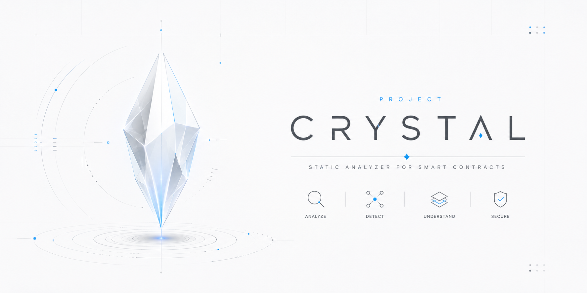
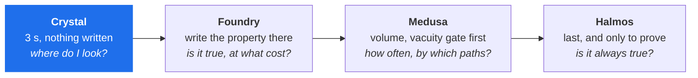
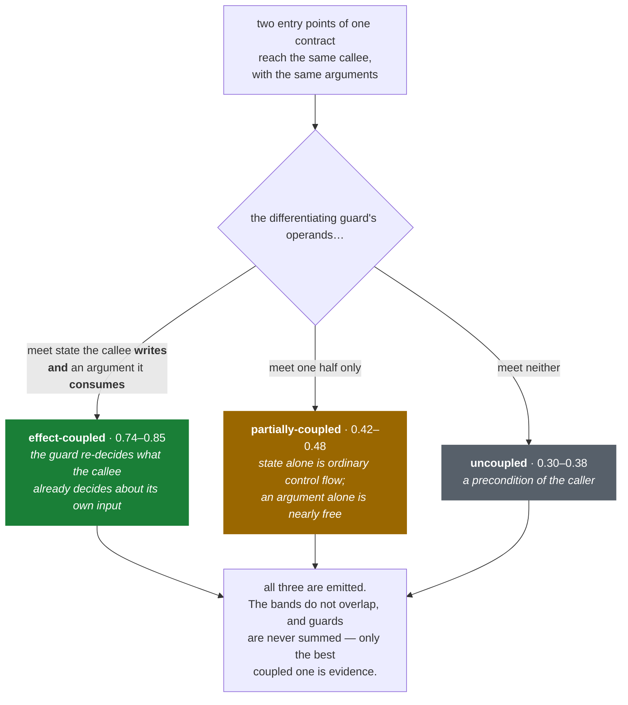
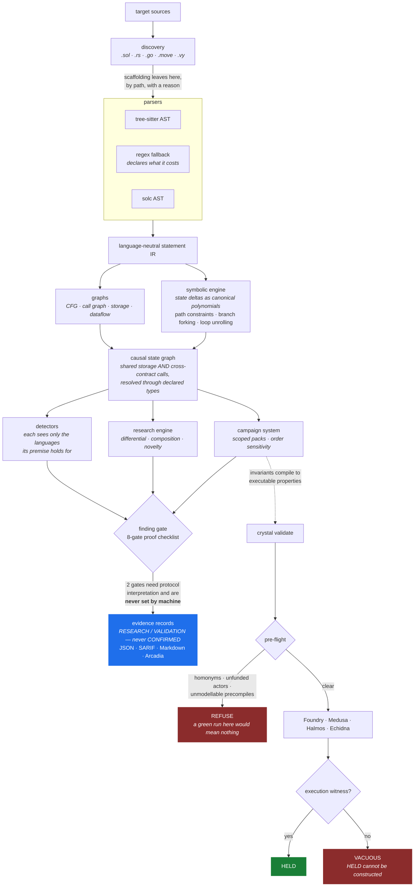

<p align="center">
  
</p>

<h1 align="center">Crystal V1.00 Build 015</h1>

<p align="center">
  <em>A protocol-oriented security research engine for smart contracts and Substrate runtimes.</em><br>
  <strong>It produces evidence. It never produces a confirmed finding.</strong>
</p>

<p align="center">
  <a href="https://github.com/Valisthea/crystal/actions/workflows/ci.yml"></a>
  
  
  
  
  
  
</p>

---

> ### Beta
>
> Crystal is in **beta** and moving fast — fifteen builds, several of which
> corrected the build before them. Treat its output as a starting point for
> your own reading, never as a verdict.
>
> **What that means in practice.** Crystal produces evidence, and by design it
> cannot produce a confirmed finding: two of the eight proof gates require
> protocol interpretation and are never set by machine. A signal is a place to
> look, with a trace and a list of ways to prove it wrong. It is not an audit
> and does not replace one.
>
> **Known limits, all of them measured** — the point is that they are named,
> not that they are absent:
>
> * Without tree-sitter the regex front-ends lose real fidelity (`import`
>   resolution, `using X for Y`, user-defined value types, modifier bodies).
>   `crystal doctor` reports `reduced_fidelity` and the exact list.
> * **Rust is the exception with no fallback at all.** Solidity, Go, Move and
>   Vyper degrade to a regex front-end; Rust does not, so without
>   `tree-sitter-rust` a Substrate or Anchor target parses to nothing.
>   `parser_report()` says `backend: unavailable` rather than pretending.
> * The Halmos backend is verified to compile but its verdicts are not; Echidna
>   parsing is unit-tested only, because Echidna is not installed here. Any
>   format Crystal cannot read decodes to `VACUOUS`, never `HELD`.
> * The Go front-end carries the panic class (index, nil, type assertion) in
>   its IR, and no detector consumes it yet.
> * A call inside an index expression on the left-hand side (`m[f(x)] += y`) is
>   recorded by neither Solidity front-end. Pinned as a failing test rather
>   than worked around.
>
> If a result surprises you, that is worth an issue — a wrong signal and a
> missing one are both bugs here. See [Contributing](CONTRIBUTING.md).

---

## What Crystal is

Crystal is a standalone CLI analyzer, in the same family as Slither, Medusa or
Halmos. One command, one target, one structured output:

```bash
crystal scan ./target --format sarif -o crystal.sarif
```

Where it differs from its neighbours:

| Tool | What you give it | What it gives back |
| --- | --- | --- |
| Slither | source | pattern-matched detectors |
| Medusa / Echidna | source **+ properties you wrote** | counterexamples |
| Halmos | source **+ tests you wrote** | proofs or counterexamples |
| **Crystal** | source | symbolic state deltas, candidate invariants and **research evidence it derived itself** |

Crystal answers a different question. Not *"does this match a known bug
pattern?"* but *"what does this protocol's state actually do, and where does it
behave asymmetrically?"*

It also reads **across** modules. Some defects are absent from every file taken
alone and exist only in how a runtime wires modules together — see
[Cross-module composition](#cross-module-composition).

### Measured against the execution engines

One bridge, 17 contracts, five properties — one of them known to be false.
Rootstock Flyover, 2026-09-05, on Windows 11 with solc 0.8.25.

| | **Crystal 015** | Foundry 1.6.0 | Medusa 1.5.1 | Halmos 0.3.3 |
| --- | --- | --- | --- | --- |
| Nature | static, derives its own leads | stateful fuzzing | property fuzzing | symbolic execution |
| Human input for a first lead | none | — | — | — |
| Human input to verify the five | a **293-line deployment fixture** | 1,688 harness lines | harness + config | 12 files + repairs |
| Time to a first meaningful result | **3 s** | ~50 min | ~9 min then 1 h 45 of vacuity traps | ~7 min then ~1 h of blockages |
| Machine time | 3 s | 12 min | 33 min | 2 h 03 |
| P1 · P2 · P4 (sound) | compiles harnesses | held | held | proved |
| P5 (the real defect) | **named, 0.77, no direction given** | violated, 2 calls | violated, 15 s | counterexample |
| Non-vacuity proof | **required — `HELD` is unconstructable without one** | 16/16 actions succeeded | 51 % success | 21 checks |
| Pre-flight refusal | **yes — homonyms, unfunded actors, unmodellable precompiles** | — | — | — |

**Read the last two rows first.** They are the axis, and they are the reason
this table exists at all.

The dominant failure mode of these tools is not the false positive, it is the
**silent success**. Measured on this one target: Medusa returned 35 green tests
over 1,049,043 calls with **zero successful deposits**, because the actors had
no balance. Medusa and Halmos both linked the wrong library, because the
repository declares `Quotes.sol` twice — and the copy the toolchain binds is
not even stable between builds. Halmos pins `block.number` to 1, so any branch
behind a block delay is unreachable and returns `PASS`. The project's own
invariant suite ran 64,000 times at 81 % reverts on a contract whose balance
never left zero.

None of those is a wrong answer. They are all green.

So Crystal never reports a property as held without an execution witness — the
sequences run, the per-action success ratio, the decoded revert selectors, and
proof that a transition mutating the property's own state actually succeeded.
Without it the verdict is `VACUOUS`, and `HELD` raises rather than being
constructed. And it refuses to launch a backend at all when the run could only
be meaningless.

**What Crystal does not do.** It does not fuzz, does not prove, and produces no
counterexample. Chasing Medusa's 1,317 calls a second or Halmos's SMT solver
would produce a bad clone of both. Use it first, to know where to point the
properties you are about to write — then use them.



## What Crystal is not

It is not an auditor, not an LLM, not an orchestrator, and not a report
submission system. It never decides severity and never decides whether to
submit. That judgement belongs to a human reviewer — or to Arcadia + Claude
downstream. See [ARCHITECTURE.md](ARCHITECTURE.md).

---

## Install

### Windows 11 (native, no WSL)

```powershell
git clone https://github.com/Valisthea/crystal
cd crystal
.\install.ps1
crystal doctor
crystal scan .\examples --no-solc
```

### Linux / macOS / WSL

```bash
git clone https://github.com/Valisthea/crystal
cd crystal
./install.sh
crystal doctor
```

The installer verifies Python ≥ 3.10, creates a dedicated `.venv`, installs
Crystal with the tree-sitter extra, checks `PATH`, and reports which optional
external tools are present.

Options: `-Mode user|system`, `-NoTreeSitter`, `-WithSolc` (PowerShell) or
`--mode user`, `--no-treesitter`, `--with-solc` (bash).

### Manual

```bash
pip install -e ".[treesitter]"    # full fidelity
pip install -e .                  # core only, regex fallback parsers
```

**Crystal's core has zero dependencies.** tree-sitter is optional: without it
Crystal degrades to regex parsers and says so, rather than failing — and says
what the degradation costs. The regex front-end does not resolve `import`
statements, `using X for Y` bindings, user-defined value types or modifier
bodies, so a receiver's type often cannot be identified. `parser_report()`
carries `reduced_fidelity` and the list of limitations, and it reaches the scan
output: a detector that stays quiet because it could not resolve a type must
not read as a clean result.

---

## Commands

| Command | Purpose |
| --- | --- |
| `crystal scan <target>` | analyze a project |
| `crystal doctor` | report environment readiness |
| `crystal watch <target>` | re-scan on file change, for use during an audit |
| `crystal validate <target> --backend medusa` | run an execution backend on generated harnesses |
| `crystal validate <target> --pack <pack> --fixture <spec>` | compile a pack's invariants into Foundry/Medusa/Halmos harnesses |
| `crystal scan <target> --pack <pack>` | load an operator campaign pack (dotted module or `.py` path) |
| `crystal campaign list` | list registered campaign packs |
| `crystal campaign run <id> <target>` | run a single campaign against a project |
| `crystal capabilities` | list engine capabilities |
| `crystal update` | self-update a git checkout |

### `scan`

```bash
crystal scan ./target                          # JSON to stdout
crystal scan ./target --format markdown -o report.md
crystal scan ./target --format sarif -o crystal.sarif      # IDE / CI
crystal scan ./target --format arcadia -o handoff.json     # Arcadia / OMEGA
crystal scan ./target --lang rust --no-solc
crystal scan ./target --detectors reentrancy,access-control
crystal scan ./target --no-treesitter          # force the fallback parsers
crystal scan ./target --no-foundry             # skip real-EVM execution
crystal scan ./target --include-tests          # research fixtures too
crystal scan ./target --pack ./packs/flyover.py            # operator campaign pack
crystal scan ./target --pack crystal.packs.ens             # or a dotted module
```

`--pack` is repeatable. Campaigns run on every scan and are reported in every
format, including the ones that found nothing and why they pruned — a campaign
that reported nothing searched its scope, which is a result, not an absence.

Output formats: `json`, `markdown`, `sarif`, `arcadia`.

### Detectors

| Detector | Fires on |
| --- | --- |
| `reentrancy-ordering` | an external call transfers control before the state update that guards it |
| `missing-access-control` | an entry point writes authority-bearing state with no observable check on the caller |
| `first-depositor-inflation` | share issuance divides by a supply an early depositor can skew |
| `oracle-manipulation-surface` | accounting consumes a price movable inside one transaction |
| `unbounded-input-in-value-op` | a caller-chosen value with no upper bound reaches the amount position of a value operation |
| `ignored-outcome-in-settlement` | a settlement frame is handed the operation's result, discards it, and moves value anyway |
| `pipeline-guard-bypass` | one stage of a runtime pipeline moves value through a mechanism another stage's guard does not cover |
| `asymmetric-side-effect` | two entry points of one contract reach the same state transition, one behind a revocable condition the other lacks. Graded by *coupling*: whether that condition speaks about the state the shared callee writes and the arguments it consumes |
| `asymmetric-companion` | a value operation omits a companion call that most equivalent paths include. Its confidence is a **convention ratio**, not a defect confidence, and it is a separate detector because nothing establishes that a number from it is comparable to one from the detector above |

Every signal carries a line-anchored ordered trace and a falsification list, and
is `RESEARCH` status. None of them can produce a confirmed finding.

#### The coupling grade

Two entry points reaching the same callee, one behind a condition the other
lacks, is a common shape and *usually deliberate*. What separates a redundant
gate from a correct difference is not how many conditions there are — it is
what the condition is **about**.



This was calibrated against three evaluated cases on three unrelated public
protocols, after the previous scoring ranked the *least* coupled case first and
the only real defect second. The discriminant is relational, so it carries none
of those protocols' vocabulary — a test asserts the detector's source contains
none of their words.

Nothing is suppressed to improve a rank: a weak grade is still emitted, and
says in its own evidence why it is weak. Precision is won by ordering, not by
silence.

---

## What a scan produces

```
$ crystal scan ./examples --no-solc --format markdown
```

```markdown
### External call precedes state update in Vault.withdraw

- Detector: `reentrancy-ordering` — confidence 0.94 — status `RESEARCH`
- Location: `examples/Vault.sol:15`
- Mechanism: an external call transfers control before the state update,
  so a re-entrant call observes stale state

Evidence:
- external call `msg.sender.call{value: amount}("")` at line 15
- state written after the call: balances, totalAssets
- state read before the call and written after: balances
- call forwards value to the callee

Ordered trace:
    L15 external_call: msg.sender.call{value: amount}("")
    L17 state_write[balances]: balances[msg.sender] -= amount
    L18 state_write[totalAssets]: totalAssets -= amount

Falsify this before believing it:
- Is the external callee trusted and immutable?
- Does a guard elsewhere on the path already prevent re-entry?
- Is the post-call write idempotent, so a nested call cannot benefit?
```

Every signal carries an **ordered trace anchored to line numbers** and a
**falsification list**. Crystal tells you how to prove it wrong.

### Symbolic state deltas

```
| Sequence                       | Delta                                                  |
| ------------------------------ | ------------------------------------------------------ |
| Vault.deposit -> Vault.donate  | Vault::totalAssets = ARG:msg.value#1 + ARG:msg.value#2 |
|                                | Vault::totalSupply = ARG:msg.value#1                   |
```

`totalAssets` moved twice while `totalSupply` moved once. That asymmetry is a
donation path — the ingredient of a share-inflation attack — and Crystal found
it without knowing what `donate` means. State is named by contract, because
`balances` alone does not identify a slot on a multi-contract protocol — see
[State is namespaced by contract](#state-is-namespaced-by-contract).

---

## How it works



Two edges in that diagram carry the whole discipline. The finding gate has two
checks a machine never sets, so `CONFIRMED` is unreachable by construction. And
`HELD` is not a label the backend layer may apply — `PropertyVerdict` raises
without a witness, so a `VACUOUS` cannot be promoted after the fact.

### The symbolic engine

State is tracked as a canonical polynomial over attacker-controlled symbols:

```solidity
function transfer(address to, uint256 a) external {
    balances[msg.sender] -= a;
    balances[to] += a;
}
```
→ `delta(balances) = 0` — the engine proves conservation, it does not guess it.

```solidity
if (totalSupply == 0) { shares = assets; }
else { shares = assets * totalSupply / totalAssets; }
```
→ two paths, one of which yields
`DIV(ARG:assets*S0:totalSupply/S0:totalAssets)` — the exact expression an
inflation attack manipulates.

Anything the engine cannot model exactly — inline assembly, unbounded loops,
unresolved storage mutations — is recorded in `unsupported`, never
approximated.

### State is namespaced by contract

A state variable is unique only inside its contract, so anything that merges
state across contracts keys on `Alpha::balances`, not `balances`:

```
| Sequence                       | Delta                          |
| ------------------------------ | ------------------------------ |
| Alpha.credit -> Beta.debit     | Alpha::balances = ARG:a#1      |
|                                | Beta::balances  = -ARG:a#2     |
```

Keyed on the bare name, those two lines collapse into
`balances = ARG:a#1 - ARG:a#2` — which reads as a conservation law across a
sequence where two unrelated contracts each moved money. The same collision
gave the causal graph an edge between any two contracts that shared a variable
name, and those edges feed sequence generation and campaigns.

**Identity is qualified; meaning is bare.** Category classification, accounting
pairs and campaign invariants all read through the bare name, so namespacing
separates contracts without changing what any classifier concludes. Inherited
state resolves to the declaring contract, so `Child.balances` and
`Parent.balances` remain one slot.

### Multi-language

| Language | Backend | Maps to |
| --- | --- | --- |
| Solidity | tree-sitter, regex fallback | contracts, functions, modifiers, events |
| Rust (Substrate) | tree-sitter | `#[pallet::storage]` → state, `#[pallet::call]` → extrinsics |
| Rust (Anchor) | tree-sitter | `#[program]` → instructions, `#[account]` → state |
| Rust (plain) | tree-sitter | `struct` + `impl` → contract + functions |
| Move | tree-sitter or regex | modules, resources with abilities, entry functions |
| Vyper | tree-sitter or regex | storage declarations, `@external` functions |

Substrate storage calls are lowered into ordinary IR assignments, so
`TotalSupply::<T>::mutate(|t| *t += amount)` yields
`delta(TotalSupply) = ARG:amount` exactly like Solidity's `+=`.

Test fixtures are classified and excluded from research by default. A mock
runtime mutates state and skips authority checks *by design*, so leaving it in
means every signal lands on the test builder rather than on production code.
They are still parsed and still listed, under `excluded_test_contracts`;
`--include-tests` restores them.

### Composition across contracts

A protocol split across contracts composes by *calling*, not by sharing
storage:

```solidity
ICollateralManagement _collateralManagement;          // PegOutContract
...
_collateralManagement.slashPegOutCollateral(who, amount);
```

Read `PegOutContract` alone and that call goes nowhere: the callee is declared
in an interface with no body. Crystal binds the declared type to the contract
that implements it, so the call becomes a causal edge and the chain is
reportable:

```
PegOutContract.refundPegOut -> CollateralManagement.slashPegOutCollateral
  call-flow via _transfer -> _collateralManagement.slashPegOutCollateral
  consumed: CollateralManagement::collateral, CollateralManagement::slashed
```

A chain is anchored on a function a caller can actually enter. When the
external call sits in an internal helper, the edge is attributed to the entry
points that reach it and the helper is named in the trace — anchoring on
`_transfer` would report a chain nobody can invoke and lose the reachable one.

Binding is by **declared type, never by bare function name** — two contracts
can both define `settle` without being the same `settle`. A protocol whose
contracts share no storage at any point therefore still produces a causal
graph, where before it produced an empty one.

### Cross-module composition

Some defects are not in any file. A Substrate runtime composes extensions into
an ordered tuple where every stage runs on every transaction:

```rust
pub type TxExtension = (
    …
    ReversibleTransactionExtension<Runtime>,   // [7] rejects protected accounts
    WormholeProofRecorderExtension<Runtime>,   // [8]
    ChargeTransactionPayment<Runtime>,         // [9] debits the signer
    …
);
```

Read stage 7 and it is correct. Read stage 9 and it is correct. They disagree
only in composition: the guard gates *call dispatch*, the payment stage takes a
*fee*, and a fee is not a dispatch. Crystal reports it:

```
[7] ReversibleTransactionExtension GUARD       — gates call-dispatch
[8] WormholeProofRecorderExtension OBSERVES
[9] ChargeTransactionPayment       MOVES-VALUE — debits the signer via fees
    -> OnChargeTransaction::withdraw_fee -> FungibleAdapter
boundary: stage 9 debits the signer through fees, which stage 7 does not
          cover: it gates call-dispatch
```

Three things make this usable rather than noisy:

- **A guard is about authority, not rejection.** `CheckNonce` rejects
  constantly and guards nothing — it compares a counter. Stages are classified
  `GUARD` / `MOVES-VALUE` / `CHECKS-ONLY` / `OBSERVES`, and only a rejection
  that consults restriction state about a principal counts as a guard. The
  `CHECKS-ONLY` stages are named in the evidence, so the report says why they
  were not treated as guards.
- **Coverage is decided by mechanism.** A guard on transfers covering a
  transfer is the system working, and stays silent.
- **Associated types are resolved.** `T::OnChargeTransaction::withdraw_fee`
  points nowhere until `impl pallet_x::Config for Runtime` is read; Crystal
  reads it, so the debit lands on the implementation that actually moves value.
  A stage inherits what its bound implementation does.

Both runtime macro formats are supported (`#[frame_support::runtime]` and
`construct_runtime!`), and mock runtimes are excluded from the topology.

**Only declared composition is visible** — tuples, runtime macros, Config
impls. Composition that emerges at runtime is not, and a boundary Crystal does
not report is not evidence of absence. Scanning a single pallet cannot show
composition at all, so Crystal warns instead of reporting zero crossings as a
result:

```
WARNING: scanning without a runtime crate. Cross-module composition requires
the runtime (with construct_runtime! / #[frame_support::runtime] and the
TxExtension tuple). Run `crystal scan <workspace_root>` for full pipeline
analysis; intra-module signals are unaffected.
```

---

## The evidence discipline

Crystal separates:

```
signal → hypothesis → validation → evidence
```

from:

```
protocol interpretation → exploit chain → severity → final finding
```

The second chain is not Crystal's job.

**Three rules that are enforced by tests, not by convention:**

1. **Zero fabrication.** Missing an ABI type, a constructor argument or a
   deployment context means `UNSUPPORTED` with the precise reason — never a
   guess.
2. **Zero confirmed findings.** The proof checklist has eight gates. Two of
   them — `economic_impact` and `minimal_trace` — are *never* set
   automatically, because they require protocol interpretation. `CONFIRMED` is
   therefore unreachable by machine.
3. **SARIF severity never escalates.** Every result is `level: note`,
   `kind: review`. Crystal will not tell your CI that something is broken.

---

## Validation backends

Backends are **execution backends, not an orchestration layer**: Crystal
generates the harness and the properties itself, then asks the tool to run
them. It never reads another tool's findings — cross-tool correlation belongs
to Arcadia.

```bash
crystal validate ./target --backend medusa  --out-dir ./artifacts
crystal validate ./target --backend echidna --generate-only --out-dir ./artifacts
crystal validate ./target --backend halmos  --out-dir ./artifacts
crystal validate ./target --backend foundry --out-dir ./artifacts
```

Properties are derived only when they are mechanically expressible from public
getters. Aggregate conservation (sum of balances vs totals) needs an enumerable
holder set, so Crystal declines it and says why.

---

## Integration

```bash
crystal scan ./target --format arcadia -o handoff.json
```

```json
{
  "schema_version": "crystal-arcadia/2.0",
  "producer": { "role": "evidence-only",
                "decides_severity": false,
                "decides_submission": false },
  "signals": { "detectors": [...], "delta_anomalies": [...] },
  "state_model": { "state_deltas": [...], "invariant_candidates": [...] },
  "gate": { "policy": "zero-false-positive-confirmed" }
}
```

The v1 JSON schema is preserved field-for-field; v2 only adds. A regression
test pins every v1 key.

---

## Development

```bash
pip install -e ".[dev]"
pytest -q                                  # 138 tests
CRYSTAL_NO_TREESITTER=1 pytest -q          # regex fallback path
CRYSTAL_NO_FOUNDRY=1 pytest -q             # skip real-EVM execution
```

Environment variables: `CRYSTAL_NO_TREESITTER`, `CRYSTAL_NO_FOUNDRY`.

## Documentation

- [ARCHITECTURE.md](ARCHITECTURE.md) — the architecture contract and non-goals
- [CHANGELOG.md](CHANGELOG.md) — build history, and what each build measured
- [CRYSTAL_V2.0.md](CRYSTAL_V2.0.md) — the Build 001 engine rebuild
- [INTEGRATION.md](INTEGRATION.md) — consuming Crystal from another system
- [docs/ARCADIA_HANDOFF.md](docs/ARCADIA_HANDOFF.md) — Arcadia integration and campaign system
- [LAB_HANDOFF.md](LAB_HANDOFF.md) — laboratory handoff notes

## Contributing

Crystal is open to contributions. The engine is in beta and the most useful
thing you can send is a target it gets wrong — a signal that is false, or a
defect it stayed silent on. Both are bugs.

Read [CONTRIBUTING.md](CONTRIBUTING.md) first: it sets out the three rules that
are enforced by tests rather than by review, and they will reject a change that
ignores them.

To report a vulnerability **in Crystal itself**, see [SECURITY.md](SECURITY.md).

## Licence

MIT — see [LICENSE](LICENSE). Copyright (c) 2026 Kairos Lab.
