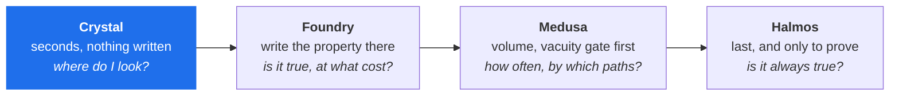
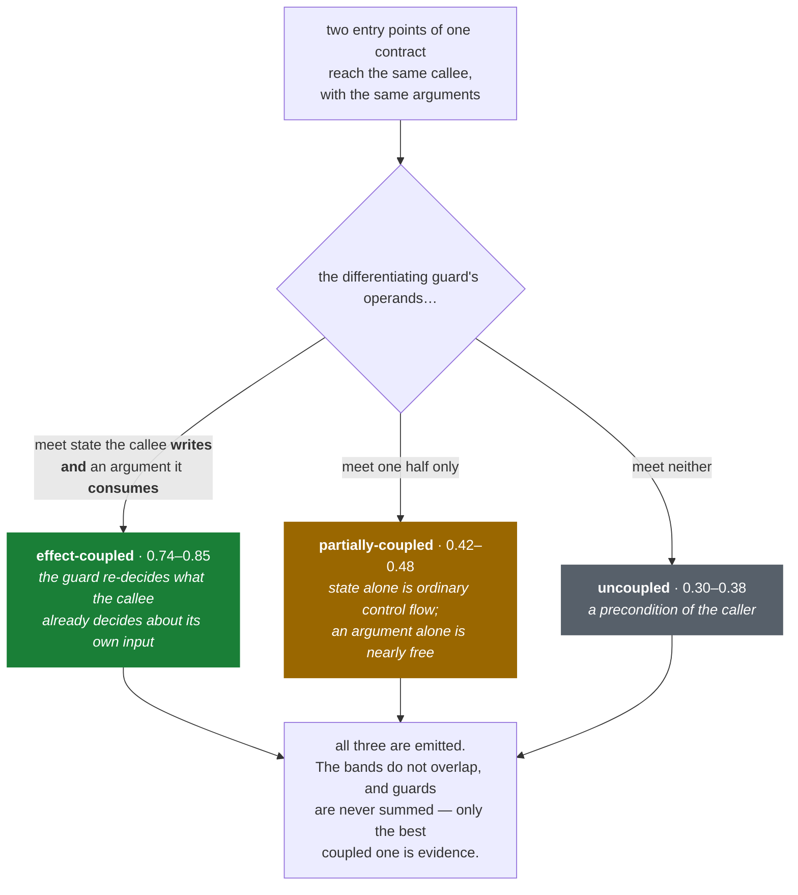
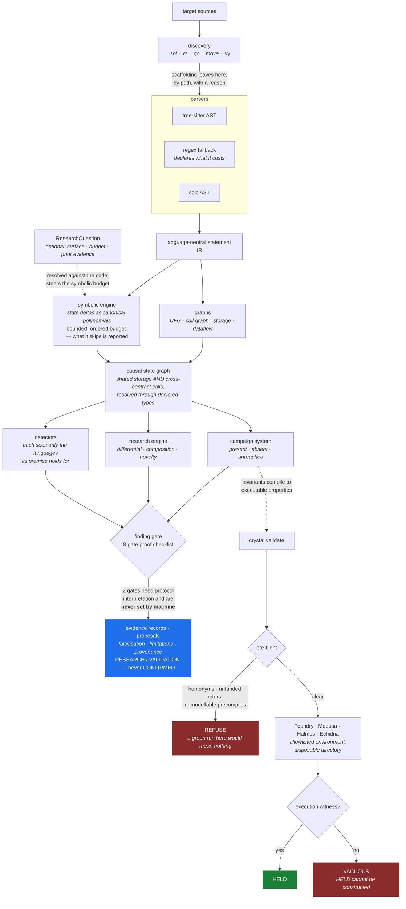

<p align="center">
  
</p>

<h1 align="center">Crystal V1.00 Build 022</h1>

<p align="center">
  <em>A protocol-oriented security research engine for smart contracts and Substrate runtimes.</em><br>
  <strong>It produces evidence. It never produces a confirmed finding.</strong>
</p>

<p align="center">
  <a href="https://github.com/Valisthea/crystal/actions/workflows/ci.yml"></a>
  
  
  
  
  
  
</p>

---

> ### Beta
>
> Crystal is in **beta** and moving fast — twenty-two builds, several of which
> corrected the build before them. Treat its output as a starting point for
> your own reading, never as a verdict.
>
> **What that means in practice.** Crystal produces evidence, and by design it
> cannot produce a confirmed finding: two of the eight proof gates require
> protocol interpretation and are never set by machine. A signal is a place to
> look, with a trace and a list of ways to prove it wrong. It is not an audit
> and does not replace one.
>
> **Known limits, all of them measured** — the point is that they are named,
> not that they are absent:
>
> * Without tree-sitter the regex front-ends lose real fidelity (`import`
>   resolution, `using X for Y`, user-defined value types, modifier bodies).
>   `crystal doctor` reports `reduced_fidelity` and the exact list.
> * **Rust has no fallback at all.** Solidity, Go, Move and Vyper degrade to a
>   regex front-end; Rust does not, so without `tree-sitter-rust` a Substrate or
>   Anchor target parses to nothing. `parser_report()` says
>   `backend: unavailable` rather than pretending.
> * **External tools are not sandboxed.** Crystal withholds your environment
>   from them and runs them in a disposable directory, but they execute as you,
>   on your host. Analyse a hostile target inside a disposable machine.
> * Halmos and Medusa have produced witness-backed verdicts through Crystal on
>   small fixtures only; Echidna output parsing is unit-tested only, because
>   Echidna is not installed on the development machine. Any format Crystal
>   cannot read decodes to `VACUOUS`, never `HELD`.
> * A call inside an index expression on the left-hand side (`m[f(x)] += y`) is
>   recorded by neither Solidity front-end, and `unbounded-input-in-value-op`
>   does not read a bound written as an early exit (`if (x > cap) revert();`).
>   Both are pinned as strict failing tests rather than worked around.
> * The Go front-end carries the panic class (index, nil, type assertion) in
>   its IR, and no detector consumes it yet.
> * A research question's `asset_flow`, `state_transition` and
>   `contract_family` surfaces are not yet mapped onto code, and
>   `depth="adaptive"` is declared but not implemented. Both are reported as
>   such on every run, never silently approximated.
>
> If a result surprises you, that is worth an issue — a wrong signal and a
> missing one are both bugs here. See [Contributing](CONTRIBUTING.md).

---

## Contents

- [What Crystal is](#what-crystal-is) · [How it compares](#how-it-compares) · [What Crystal is not](#what-crystal-is-not)
- [Install](#install) · [Quick start](#quick-start) · [Commands](#commands) · [Detectors](#detectors)
- [What a scan produces](#what-a-scan-produces)
- [Asking Crystal a question](#asking-crystal-a-question)
- [How it works](#how-it-works)
- [The evidence discipline](#the-evidence-discipline) · [What an analysed target's tooling can reach](#what-an-analysed-targets-tooling-can-reach)
- [Validation backends](#validation-backends) · [Integration](#integration)
- [Development](#development) · [Documentation](#documentation) · [Contributing](#contributing)

---

## What Crystal is

Crystal is a standalone analyzer for smart contracts, in the same family as
Slither, Medusa or Halmos. It reads source, models what the protocol's state
actually does, and returns **structured research evidence** — each item with a
line-anchored trace, the ways it could be wrong, and where it came from.

It can be used three ways:

| | |
| --- | --- |
| **Scan** | `crystal scan ./target` — one command, no properties to write, a result in seconds |
| **Ask** | a [`ResearchQuestion`](#asking-crystal-a-question) names the surface, constraints, budget and prior evidence; Crystal plans, steers its analysis to that surface, and says what it could and could not establish |
| **Validate** | `crystal validate` compiles properties Crystal derived into Foundry, Medusa, Halmos or Echidna harnesses — and refuses to report a property as held without proof the run actually exercised it |

Crystal answers a different question from its neighbours. Not *"does this match
a known bug pattern?"* but *"what does this protocol's state actually do, and
where does it behave asymmetrically?"* It also reads **across** contracts and
modules: some defects exist in no single file, only in how a protocol wires its
pieces together.

## How it compares

### What each tool asks of you, and gives back

| Tool | What you give it | What it gives back |
| --- | --- | --- |
| Slither | source | pattern-matched detector results |
| Foundry | source **+ tests and invariants you wrote** | pass / fail, counterexamples |
| Medusa / Echidna | source **+ properties you wrote** | counterexamples from fuzzing |
| Halmos | source **+ tests you wrote** | symbolic proofs or counterexamples |
| **Crystal** | source — **or a research question** | symbolic state deltas, relational invariants, detector signals and campaign candidates it derived itself, each carrying falsification, limitations and provenance |

| | Slither | Foundry | Medusa / Echidna | Halmos | **Crystal** |
| --- | :---: | :---: | :---: | :---: | :---: |
| Finds leads with nothing written by you | ✓ | — | — | — | **✓** |
| Executes the code | — | concrete | fuzzed | symbolic | its own symbolic engine over the IR, and drives the other four as backends |
| Produces a counterexample | — | ✓ | ✓ | ✓ | **never** — it produces evidence |
| Takes a question with a surface, a budget and prior evidence | — | — | — | — | **✓** |

Crystal reads **Solidity, Vyper, Move, Rust (Substrate, Anchor) and Go**.
It is not a replacement for any of the others. It is the step before them: find
where to look, then write the property there.

### Measured against the execution engines

One bridge — Rootstock Flyover (`rsksmart/liquidity-bridge-contract`), 17
contracts — and five properties, one of them known to be false. Measured
2026-09-05 at Build 015 on Windows 11 with solc 0.8.25. **Crystal's time and
P5 rows were re-measured at Build 021 on 2026-09-24** (commit `bc01477`,
`crystal scan --no-solc --no-foundry`, three runs); its verification rows, and
every other column, are the 2026-09-05 measurements.

| | **Crystal 021** | Foundry 1.6.0 | Medusa 1.5.1 | Halmos 0.3.3 |
| --- | --- | --- | --- | --- |
| Nature | static, derives its own leads | stateful fuzzing | property fuzzing | symbolic execution |
| Human input for a first lead | none | — | — | — |
| Human input to verify the five | a **293-line deployment fixture** | 1,688 harness lines | harness + config | 12 files + repairs |
| Time to a first meaningful result | **2.6–3.0 s** | ~50 min | ~9 min, then 1 h 45 of vacuity traps | ~7 min, then ~1 h of blockages |
| Machine time | 2.6–3.0 s | 12 min | 33 min | 2 h 03 |
| P1 · P2 · P4 (sound) | compiles harnesses | held | held | proved |
| P5 (the real defect) | **named, 0.77, rank 1 of 3 signals, no direction given** | violated, 2 calls | violated, 15 s | counterexample |
| Non-vacuity proof | **required — `HELD` is unconstructable without one** | 16/16 actions succeeded | 51 % success | 21 checks |
| Pre-flight refusal | **yes — homonyms, unfunded actors, unmodellable precompiles** | — | — | — |

**Read the last two rows first.** They are the axis, and the reason this table
exists at all.

The dominant failure mode of these tools is not the false positive, it is the
**silent success**. Measured on this one target: Medusa returned 35 green tests
over 1,049,043 calls with **zero successful deposits**, because the actors had
no balance. Medusa and Halmos both linked the wrong library, because the
repository declares `Quotes.sol` twice — and the copy the toolchain binds is not
even stable between builds. Halmos pins `block.number` to 1, so any branch
behind a block delay is unreachable and returns `PASS`. The project's own
invariant suite ran 64,000 times at 81 % reverts on a contract whose balance
never left zero.

None of those is a wrong answer. They are all green.

So Crystal never reports a property as held without an execution witness — the
sequences run, the per-action success ratio, the decoded revert selectors, and
proof that a transition mutating the property's own state actually succeeded.
Without it the verdict is `VACUOUS`, and `HELD` raises rather than being
constructed. It also refuses to launch a backend at all when the run could only
be meaningless.

**What Crystal does not do.** It does not fuzz, does not prove, and produces no
counterexample. Chasing Medusa's 1,317 calls a second or Halmos's SMT solver
would produce a bad clone of both — throughput is the one axis Crystal
deliberately does not compete on. Use it first, to know where to point the
properties you are about to write; then use them.



## What Crystal is not

It is not an auditor, not an LLM, not an orchestrator, and not a report
submission system. It never decides severity, never decides whether to submit,
never decides what to investigate next across targets, and never declares
research complete. Those judgements belong to a human reviewer, or to the
systems above it — Arcadia and MIRA — which read Crystal's evidence and decide.
See [ARCHITECTURE.md](ARCHITECTURE.md) and
[docs/mira-integration.md](docs/mira-integration.md).

---

## Install

### Windows 11 (native, no WSL)

```powershell
git clone https://github.com/Valisthea/crystal
cd crystal
.\install.ps1
crystal doctor
crystal scan .\examples --no-solc
```

### Linux / macOS / WSL

```bash
git clone https://github.com/Valisthea/crystal
cd crystal
./install.sh
crystal doctor
```

The installer verifies Python ≥ 3.10, creates a dedicated `.venv`, installs
Crystal with the tree-sitter extra, checks `PATH`, and reports which optional
external tools are present.

Options: `-Mode user|system`, `-NoTreeSitter`, `-WithSolc` (PowerShell) or
`--mode user`, `--no-treesitter`, `--with-solc` (bash).

### Manual

```bash
pip install -e ".[treesitter]"    # full fidelity
pip install -e .                  # core only, regex fallback parsers
```

**Crystal's core has zero dependencies.** tree-sitter is optional: without it
Crystal degrades to regex parsers and says so, rather than failing — and says
what the degradation costs. `parser_report()` carries `reduced_fidelity` and
the list of limitations into the scan output, because a detector that stays
quiet for lack of a resolved type must not read as a clean result.

`crystal doctor` also reports whether the running Crystal is the checkout you
are standing in. A copy installed without `-e` keeps running the build it was
installed at; if doctor says the build differs from `HEAD`, run
`pip install -e .` from the checkout.

Optional external tools, each detected rather than assumed: `solc`, `forge`
(Foundry), `medusa`, `halmos`, `echidna`.

## Quick start

```bash
crystal doctor                                   # what is installed, what is isolated
crystal scan ./examples --no-solc --format markdown
crystal scan ./target --format sarif -o crystal.sarif
crystal validate ./target --backend medusa --out-dir ./artifacts
crystal ask question.json --project ./target     # a research question, from any process
```

See [Asking Crystal a question](#asking-crystal-a-question) for what goes in
`question.json` and what comes back.

## Commands

| Command | Purpose |
| --- | --- |
| `crystal scan <target>` | analyze a project |
| `crystal doctor` | report environment readiness, install drift and isolation |
| `crystal watch <target>` | re-scan on file change, for use during an audit |
| `crystal validate <target> --backend medusa` | run an execution backend on generated harnesses |
| `crystal validate <target> --pack <pack> --fixture <spec>` | compile a pack's invariants into Foundry / Medusa / Halmos harnesses |
| `crystal scan <target> --pack <pack>` | load an operator campaign pack (dotted module or `.py` path) |
| `crystal campaign list` | list registered campaign packs |
| `crystal campaign run <id> <target>` | run a single campaign against a project |
| `crystal capabilities` | list engine capabilities |
| `crystal ask <question.json> --project <path>` | answer a research question; always one `crystal-question-result/1.0` envelope, and an exit code that matches it |
| `crystal ask --print-schema question\|result` | print the JSON Schema a caller builds against |
| `crystal update` | self-update a git checkout |

### `scan`

```bash
crystal scan ./target                          # JSON to stdout
crystal scan ./target --format markdown -o report.md
crystal scan ./target --format sarif -o crystal.sarif      # IDE / CI
crystal scan ./target --format arcadia -o handoff.json     # hand-off to Arcadia / MIRA
crystal scan ./target --lang rust --no-solc
crystal scan ./target --detectors reentrancy,access-control   # keys below
crystal scan ./target --no-detectors           # state model and research only
crystal scan ./target --no-treesitter          # force the fallback parsers
crystal scan ./target --no-foundry             # skip real-EVM execution
crystal scan ./target --include-tests          # research fixtures too
crystal scan ./target --pack ./packs/flyover.py            # operator campaign pack
crystal scan ./target --pack crystal.packs.ens             # or a dotted module
crystal scan ./target --quiet -o result.json
```

`--pack` is repeatable. Campaigns run on every scan and are reported in every
format, including the ones that found nothing — each says whether its premise
was **absent** from the target or **unreached** by the analysis, because those
are opposite results that both look like zero.

Output formats: `json`, `markdown`, `sarif`, `arcadia`.

## Detectors

| Detector | `--detectors` key | Fires on |
| --- | --- | --- |
| `reentrancy-ordering` | `reentrancy` | an external call transfers control before the state update that guards it |
| `missing-access-control` | `access-control` | an entry point writes authority-bearing state with no observable check on the caller |
| `first-depositor-inflation` | `first-depositor` | share issuance divides by a supply an early depositor can skew |
| `oracle-manipulation-surface` | `oracle-manipulation` | accounting consumes a price movable inside one transaction |
| `unbounded-input-in-value-op` | `unbounded-input` | a caller-chosen value with no upper bound reaches the amount position of a value operation |
| `ignored-outcome-in-settlement` | `ignored-outcome` | a settlement frame is handed the operation's result, discards it, and moves value anyway |
| `pipeline-guard-bypass` | `pipeline-bypass` | one stage of a runtime pipeline moves value through a mechanism another stage's guard does not cover |
| `asymmetric-side-effect` | `asymmetric-side-effect` | two entry points of one contract reach the same state transition, one behind a revocable condition the other lacks. Graded by *coupling*: whether that condition speaks about the state the shared callee writes and the arguments it consumes |
| `asymmetric-companion` | `asymmetric-companion` | a value operation omits a companion call that most equivalent paths include. Its confidence is a **convention ratio**, not a defect confidence, and it is a separate detector because nothing establishes that a number from it is comparable to one from the detector above |

Every signal carries a line-anchored ordered trace and a falsification list, and
is `RESEARCH` status. None of them can produce a confirmed finding. A detector's
premise decides where it runs: `reentrancy-ordering` does not run on Go, which
has no re-entrant dispatch.

### The coupling grade

Two entry points reaching the same callee, one behind a condition the other
lacks, is a common shape and *usually deliberate*. What separates a redundant
gate from a correct difference is not how many conditions there are — it is
what the condition is **about**.



This was calibrated against three evaluated cases on three unrelated public
protocols, after the previous scoring ranked the *least* coupled case first and
the only real defect second. The discriminant is relational, so it carries none
of those protocols' vocabulary — a test asserts the detector's source contains
none of their words.

Nothing is suppressed to improve a rank: a weak grade is still emitted, and
says in its own evidence why it is weak. Precision is won by ordering, not by
silence.

---

## What a scan produces

Real output, abbreviated only where marked:

```
$ crystal scan ./examples --no-solc --no-foundry --format markdown
```

```markdown
### 1. External call precedes state update in Vault.withdraw

- Detector: `reentrancy-ordering` — confidence 0.94 — status `RESEARCH`
- Location: `examples/Vault.sol:15`
- Mechanism: an external call transfers control before the state update, so a
  re-entrant call observes stale state

Evidence:
- external call `msg.sender.call{value: amount}("")` at line 15
- low-level `call` on `msg.sender` hands execution to whatever code sits there
- state written after the call: balances, totalAssets
- state read before the call and written after: balances
- call forwards value to the callee
- same state is reachable from other entry points: Vault.deposit

Ordered trace:
    L15 external_call: msg.sender.call{value: amount}("")
    L17 state_write[balances]: balances[msg.sender] -= amount
    L18 state_write[totalAssets]: totalAssets -= amount

Falsify this before believing it:
- Is the external callee trusted and immutable (no attacker-controlled code)?
- Does a guard elsewhere on the path already prevent re-entry?
- Is the post-call write idempotent, so a nested call cannot benefit?
- Can the attacker actually reach the external call with a contract account?
- Does the resolved receiver really hold code this contract does not control?
```

Every signal carries an **ordered trace anchored to line numbers** and a
**falsification list**. Crystal tells you how to prove it wrong.

### Symbolic state deltas

On a six-line vault with a `deposit` that credits both totals and a `donate`
that credits only one:

```
| Sequence                       | Delta                                                  |
| ------------------------------ | ------------------------------------------------------ |
| Vault.deposit -> Vault.donate  | Vault::totalAssets = ARG:msg.value#1 + ARG:msg.value#2 |
|                                | Vault::totalSupply = ARG:msg.value#1                   |
```

`totalAssets` moved twice while `totalSupply` moved once, and Crystal raises
`asset-share-asymmetry` on `Vault::totalAssets`. That asymmetry is a donation
path — the ingredient of a share-inflation attack — and Crystal found it without
knowing what `donate` means.

### Research proposals

Every candidate a scan proposes carries what its producers established, and
names what they did not:

```json
{
  "id": "6f9705b8ace66361",
  "title": "Check ordering/invariant consistency for Vault.balances",
  "rationale": "A shared state variable is read and written across multiple entry points...",
  "falsification": ["[reentrancy-ordering on Vault.withdraw] Is the external callee trusted and immutable?"],
  "assumptions": ["inherits the premise of `reentrancy-ordering` on Vault.withdraw"],
  "missing": ["limitations"],
  "provenance": { "producer": "crystal", "source_digest": "576929de…", "configuration_digest": "b7103d78…" }
}
```

**Nothing is invented**: a producer that supplies no falsification leaves the
field empty and is named in `missing` — a generic sentence there would stop a
reader looking for the real one. **Falsification is cited, never composed**: it
references the detector that reasoned about its own premise, by name and
function. On the Lido stonks protocol, 55 % of proposals carry a cited
falsification and 45 % declare they have none.

**Provenance is content-addressed and carries no clock** — the same sources
under the same configuration produce the same digests on any machine, any day,
and it is never inferred from the current tree. It survives a process restart,
and the test that says so spawns a second interpreter to read the file back.

---

## Asking Crystal a question

A scan answers *what did you find*. A `ResearchQuestion` asks *can you
establish this*, about a named world, a named surface, within a stated budget,
given what is already known:

```python
from crystal.question import (
    PriorEvidence, ResearchQuestion, SourceSnapshot, Surface, Target, execute,
)

asked = ResearchQuestion(
    question="Can a quote produced under a stale Chainlink price still satisfy "
             "isValidSignature without the margin relation being preserved?",
    target=Target(target_id="lidofinance/stonks@292d063"),
    source_snapshot=SourceSnapshot(revision="292d063"),
    affected_surface=(
        Surface("function", "Order.isValidSignature"),
        Surface("state_variable", "Stonks::MARGIN_DIFFERENCE_IN_BASIS_POINTS"),
    ),
    prior_evidence=(
        PriorEvidence("W1", "fuzz harness: quote matches model", "supports",
                      {"producer": "wake", "revision": "292d063"},
                      about=(Surface("function", "Order.isValidSignature"),)),
    ),
    required_capabilities=("static", "symbolic", "composition"),
    constraints={"symbolic_budget": 30, "excluded_paths": ["stubs"]},
    depth="standard",
)
run = execute(asked, "./stonks/contracts")
run.status        # EXECUTED, or the reason it refused
run.narrowed      # what the question actually changed about the run
run.unapplied     # what it asked for and did not get
run.on_surface    # outputs split on_surface / elsewhere — never filtered
```

**Three refusals** guard failures that are silent by nature:

- **The world is never assumed.** A missing snapshot is an error, not a default:
  substituting the current checkout answers a question about a tree the asker
  never described. Resolution at execution time must be requested explicitly.
- **An empty surface never means everything.** It means "discover it", and only
  when asked for.
- **A constraint Crystal cannot enforce is an error.** One accepted and ignored
  makes a result look bounded when it was not.

**Blocked is not "found nothing".**

| status | meaning |
| --- | --- |
| `EXECUTED` | the analysis ran |
| `REFUSED_INVALID` | the question is malformed |
| `REFUSED_NO_SOURCES` | nothing analysable at the path |
| `REFUSED_UNRESOLVED_SURFACE` | nothing the question names exists in this code — refused before analysis |
| `REFUSED_UNPLANNABLE` | no strategy can answer it here |

### The question decides where the budget goes

The surface is resolved against the parsed code (functions, contracts, state
variables through the functions that touch them, call paths) and **steers the
symbolic budget**: sequences touching it run first, shared round-robin across
its items so the busiest function cannot take every slot. Same 30 slots:

| | before (Build 020) | now |
| --- | ---: | ---: |
| stonks — sequences executed that touch the surface | 13 / 30 | **30 / 30** |
| stonks — `Order.isValidSignature` | **0** | 5 (all that exist) |
| Flyover — `isCollateralSufficient` | **0** | 15 |

**Prior evidence reorders the surface and never removes anything.** Items are
reached contradicted → uncertain → unexamined → supported. A contradiction —
attributable evidence on both sides — is reported with both sides named;
Crystal does not pick one. A supported item is still analysed, later: skipping
it would be trusting a claim Crystal did not establish. Evidence that cannot be
attributed, or does not say which part of the target it concerns, steers
nothing and says why.

Without a question nothing changes: the plain scan's ordering is unaffected.

Identity is content-derived and covers the schema MAJOR only, so the same
question is recognised across releases; questions persist, reload in another
process and verify against the identity they were written with. A capability is
a kind of analysis (`symbolic`), never a tool name (`halmos`).

### From another process: `crystal ask`

An orchestrator does not need to import Crystal. It writes a question document,
calls the CLI, and reads one JSON document back:

```bash
crystal ask question.json --project ./stonks/contracts > result.json
echo $?                                # always equals result.json's exit_code
cat question.json | crystal ask - --project ./stonks/contracts --quiet
```

Whatever happens, the answer is exactly **one `crystal-question-result/1.0`
envelope** on stdout (progress goes to stderr) — including when the question
could not be read at all. Nothing a caller can send produces a traceback instead.

```json
{
  "schema_version": "crystal-question-result/1.0",
  "producer": { "role": "evidence-only", "decides_severity": false,
                "decides_submission": false, "decides_research_state": false },
  "question_id": "…",  "question": { "…": "the question as Crystal read it" },
  "status": "EXECUTED", "exit_code": 0, "analysis_ran": true, "reason": "",
  "validation": {}, "plan": {}, "surface": {}, "steering": {},
  "narrowed": {}, "unapplied": [], "on_surface": {},
  "evidence": { "schema_version": "crystal-arcadia/2.0", "…": "…" }
}
```

| status | exit | `analysis_ran` | `evidence` |
| --- | ---: | :---: | --- |
| `EXECUTED` | 0 | true | the `crystal-arcadia/2.0` payload |
| `REFUSED_INVALID` | 3 | false | `null` |
| `REFUSED_NO_SOURCES` | 4 | false | `null` |
| `REFUSED_UNRESOLVED_SURFACE` | 5 | false | `null` |
| `REFUSED_UNPLANNABLE` | 6 | false | `null` |
| `REFUSED_UNREADABLE` — not JSON, unknown schema major, meaning changed in transit | 10 | false | `null` |

`analysis_ran` and `evidence` are what separate "not run" from "found nothing" —
a refusal and a clean result both contain no findings. The evidence is not a
second format: it is the same `crystal-arcadia/2.0` payload a scan writes,
nested whole. Both documents have published JSON Schemas —
[`schemas/crystal-research-question-1.json`](schemas/crystal-research-question-1.json)
and [`schemas/crystal-question-result-1.json`](schemas/crystal-question-result-1.json),
or `crystal ask --print-schema question|result` — and the result schema itself
forbids evidence on a refusal and a zero exit code on anything but `EXECUTED`,
so a consumer that validates is protected even from a faulty producer.

Full contract, validation codes, depths and migration from `research()`:
[docs/research-question.md](docs/research-question.md).

---

## How it works



Two edges in that diagram carry the whole discipline. The finding gate has two
checks a machine never sets, so `CONFIRMED` is unreachable by construction. And
`HELD` is not a label the backend layer may apply — `PropertyVerdict` raises
without a witness, so a `VACUOUS` cannot be promoted after the fact.

### The symbolic engine

State is tracked as a canonical polynomial over attacker-controlled symbols:

```solidity
function transfer(address to, uint256 a) external {
    balances[msg.sender] -= a;
    balances[to] += a;
}
```
→ `delta(balances) = 0` — the engine proves conservation, it does not guess it.

```solidity
if (totalSupply == 0) { shares = assets; }
else { shares = assets * totalSupply / totalAssets; }
```
→ two paths, one of which yields
`DIV(ARG:assets*S0:totalSupply/S0:totalAssets)` — the exact expression an
inflation attack manipulates.

Anything the engine cannot model exactly — inline assembly, unbounded loops,
unresolved storage mutations — is recorded in `unsupported`, never
approximated.

### The symbolic budget is ordered, and what it skips is reported

Executing a sequence symbolically is the expensive step, so Crystal executes a
bounded number of the hypotheses it generates — 150 by default. On the Lido
stonks protocol 175 of 198 hypotheses share one score, so the boundary falls
inside a tie. Crystal once broke that tie alphabetically. It now breaks it by
**downstream demand** — a detector already fired on the path, the chain crosses
contracts, some function on it writes state — and never by a name. Measured on
two protocols with the budget unchanged:

| | stonks | Flyover |
| --- | ---: | ---: |
| sequences skipped that already carried evidence — before | 22 of 48 | 37 of 100 |
| — after | **4 of 48** | **2 of 100** |
| distinct findings lost | none | none |

Every skipped hypothesis is reported with its score, its demand and the reason,
and so is the width of the tie at the boundary. **Raising the budget is not the
fix**, and the report says so where somebody would reach for it.

### Protocol claims rest on relations, not on names

Crystal derives the ledger, oracle and value-scaling statements a fuzzing
campaign can be pointed at. It once derived them from spelling — and on a real
protocol **all 21 "fee" invariants had matched the substring `fee` inside the
word `Feed`**. Each generator now reads the statement IR:

| claim | what has to be observed |
| --- | --- |
| oracle | an external call to a *declared* price method whose result reaches state or a return — and no freshness guard on the path |
| ledger | two non-mapping state variables carrying quantities, written in the same direction by the same function, never in opposite directions |
| value-scaling | a configurable numeric state variable multiplying or dividing a value that flows through the function, whose result reaches somebody |
| token entry point | the published ABI signature, `transfer(address,uint256)` — not the name alone |
| monotonicity | every observed write to the variable increments it |

Names still appear, and the distinction is deliberate: `latestRoundData` is a
promise Chainlink publishes in an ABI, `getPriceThing` is a developer's
spelling. `constant` versus `immutable` is read the same way — a basis-point
denominator is 10000 in every deployment, while an `immutable` set from a
constructor argument is the value an operator can pick wrong. An invariant the
source already asserts is not raised: repeating a guard back to its author is
not evidence.

### State is namespaced by contract

A state variable is unique only inside its contract, so anything that merges
state across contracts keys on `Alpha::balances`, not `balances`:

```
| Sequence                       | Delta                          |
| ------------------------------ | ------------------------------ |
| Alpha.credit -> Beta.debit     | Alpha::balances = ARG:a#1      |
|                                | Beta::balances  = -ARG:a#2     |
```

Keyed on the bare name, those two lines collapse into
`balances = ARG:a#1 - ARG:a#2` — a conservation law across two unrelated
contracts that each moved money. **Identity is qualified; meaning is bare.**
Classification reads the bare name, so namespacing separates contracts without
changing what any classifier concludes. Inherited state resolves to the
declaring contract.

### Multi-language

| Language | Backend | Maps to |
| --- | --- | --- |
| Solidity | tree-sitter, regex fallback | contracts, functions, modifiers, events |
| Rust (Substrate) | tree-sitter | `#[pallet::storage]` → state, `#[pallet::call]` → extrinsics |
| Rust (Anchor) | tree-sitter | `#[program]` → instructions, `#[account]` → state |
| Rust (plain) | tree-sitter | `struct` + `impl` → contract + functions |
| Go | tree-sitter, regex fallback | packages, structs, methods; the panic class carried in the IR |
| Move | tree-sitter or regex | modules, resources with abilities, entry functions |
| Vyper | tree-sitter or regex | storage declarations, `@external` functions |

Substrate storage calls are lowered into ordinary IR assignments, so
`TotalSupply::<T>::mutate(|t| *t += amount)` yields
`delta(TotalSupply) = ARG:amount` exactly like Solidity's `+=`.

Test fixtures are classified and excluded from research by default. A mock
mutates state and skips authority checks *by design*, so leaving it in means
every signal lands on the test builder. They are still parsed and listed under
`excluded_test_contracts`; `--include-tests` restores them.

### Composition across contracts

A protocol split across contracts composes by *calling*, not by sharing storage:

```solidity
ICollateralManagement _collateralManagement;          // PegOutContract
...
_collateralManagement.slashPegOutCollateral(who, amount);
```

Read `PegOutContract` alone and that call goes nowhere: the callee is declared in
an interface with no body. Crystal binds the declared type to the contract that
implements it, so the call becomes a causal edge:

```
PegOutContract.refundPegOut -> CollateralManagement.slashPegOutCollateral
  call-flow via _transfer -> _collateralManagement.slashPegOutCollateral
  consumed: CollateralManagement::collateral, CollateralManagement::slashed
```

A chain is anchored on a function a caller can actually enter; binding is by
**declared type, never by bare function name** — two contracts can both define
`settle` without being the same `settle`.

### Cross-module composition

Some defects are in no file. A Substrate runtime composes extensions into an
ordered tuple where every stage runs on every transaction:

```rust
pub type TxExtension = (
    …
    ReversibleTransactionExtension<Runtime>,   // [7] rejects protected accounts
    WormholeProofRecorderExtension<Runtime>,   // [8]
    ChargeTransactionPayment<Runtime>,         // [9] debits the signer
    …
);
```

Stage 7 is correct and stage 9 is correct. They disagree only in composition:
the guard gates *call dispatch*, the payment stage takes a *fee*, and a fee is
not a dispatch. Crystal reports it:

```
[7] ReversibleTransactionExtension GUARD       — gates call-dispatch
[8] WormholeProofRecorderExtension OBSERVES
[9] ChargeTransactionPayment       MOVES-VALUE — debits the signer via fees
    -> OnChargeTransaction::withdraw_fee -> FungibleAdapter
boundary: stage 9 debits the signer through fees, which stage 7 does not
          cover: it gates call-dispatch
```

A guard is about authority, not rejection (`CheckNonce` rejects constantly and
guards nothing); coverage is decided by mechanism; associated types are resolved
through `impl pallet_x::Config for Runtime`. Both runtime macro formats are
supported. **Only declared composition is visible**, and scanning a single
pallet warns rather than reporting zero crossings as a result.

---

## The evidence discipline

Crystal separates

```
signal → hypothesis → validation → evidence
```

from

```
protocol interpretation → exploit chain → severity → final finding
```

The second chain is not Crystal's job.

**Rules enforced by tests, not by convention** — the structural ones also run as
their own named CI gate:

1. **Zero fabrication.** A missing ABI type, constructor argument or deployment
   context means `UNSUPPORTED` with the precise reason — never a guess. The same
   holds for proposals (absent falsification is named, not written) and for
   provenance (never inferred from the current tree).
2. **Zero confirmed findings.** Two of the eight proof gates — `economic_impact`
   and `minimal_trace` — are *never* set automatically, because they require
   protocol interpretation. `CONFIRMED` is unreachable by machine.
3. **No verdict without a witness.** `HELD` cannot be constructed without proof
   that a state-mutating transition succeeded.
4. **Not run is never "found nothing".** An unreadable path, an unresolvable
   surface, an unplannable question, a starved sequence and an unreached
   campaign are each reported as what they are.
5. **SARIF severity never escalates.** Every result is `level: note`,
   `kind: review`. Crystal will not tell your CI that something is broken.

## What an analysed target's tooling can reach

Crystal launches Foundry, Medusa, Halmos and Echidna on contracts it did not
write, and those tools hand the contract's own harness a way back out:
`vm.envUint("PRIVATE_KEY")` reads the process environment from inside a
Solidity test.

| | policy |
| --- | --- |
| environment | **allowlist** — only what a toolchain needs to start; everything else, secrets included, is withheld |
| filesystem | a disposable working directory per execution; the target tree is read, never written |
| process | **not sandboxed** — tools run as you, on your host |
| operator code | `--pack` and `--fixture` execute Python, and load only from a path you pass on the command line — never discovered inside the target |
| Foundry `ffi` | stated `false` in every config Crystal writes |

An allowlist rather than a denylist, because a denylist is a list of the secrets
somebody thought of. If a toolchain needs something unforeseen it stops working
loudly, and you opt it back in by name — recorded in the isolation report:

```bash
CRYSTAL_PASS_ENV=MY_REGISTRY_TOKEN crystal validate ./target --backend medusa
```

**The third row is the one that matters.** A fuzzer executing a target's
bytecode has your rights. Analyse something genuinely hostile inside a
disposable machine; `crystal doctor` prints all of this so you can check rather
than assume. `HOME` is passed because no toolchain resolves without it, so
configuration under it (such as `~/.foundry/foundry.toml`) remains reachable.
See [SECURITY.md](SECURITY.md).

## Validation backends

Backends are **execution backends, not an orchestration layer**: Crystal
generates the harness and the properties itself, then asks the tool to run them.
It never reads another tool's findings.

```bash
crystal validate ./target --backend medusa  --out-dir ./artifacts
crystal validate ./target --backend echidna --generate-only --out-dir ./artifacts
crystal validate ./target --backend halmos  --out-dir ./artifacts
crystal validate ./target --backend foundry --out-dir ./artifacts
```

Properties are derived only when mechanically expressible from public getters,
and grounded in observed writes: a ledger pair from co-moving totals,
monotonicity from every write being an increment. Aggregate conservation (sum of
balances against a total) needs an enumerable holder set, so Crystal declines it
and says why. Pre-flight refuses a run that could only be vacuous — a library
declared twice, actors with no balance, a precompile the backend cannot model.

---

## Integration

Crystal is a specialist component. The systems above it decide; Crystal answers
what it can determine, test, falsify or evidence.

```
MIRA      global research state · scheduling · coverage · completion
Arcadia   research and reasoning
Crystal   analysis · experiment · evidence          ← this repository
```

```bash
crystal scan ./target --format arcadia -o handoff.json
```

```json
{
  "schema_version": "crystal-arcadia/2.0",
  "producer": { "role": "evidence-only",
                "decides_severity": false,
                "decides_submission": false },
  "target": { "...": "..." },
  "signals": { "detectors": [], "delta_anomalies": [], "composition_candidates": [] },
  "state_model": { "state_deltas": [], "protocol_invariants": [] },
  "validation": { "...": "..." },
  "evidence_records": [],
  "isolation": { "environment": { "policy": "allowlist" }, "process": { "policy": "not sandboxed" } },
  "sequence_budget": { "executed": 150, "deferred": 48, "focus": [] },
  "producer_provenance": { "source_digest": "...", "configuration_digest": "..." },
  "campaigns": [],
  "gate": { "policy": "zero-false-positive-confirmed" },
  "quality": { "...": "..." },
  "counts": { "...": "..." }
}
```

That is the output of a scan. The question side is
[`crystal ask`](#from-another-process-crystal-ask): a question document in, a
`crystal-question-result/1.0` envelope out, the scan payload nested inside it
when the analysis ran. The capability registry (`crystal.question.export()`)
lists what Crystal can be
asked for, without claiming anything about what is installed on a given machine.
Crystal runs standalone and imports nothing from the layers above. What must
never move into it — global scheduling, coverage, saturation, hypothesis
authority, submission — is set out in
[docs/mira-integration.md](docs/mira-integration.md).

The v1 JSON schema is preserved field-for-field; v2 only adds. A regression test
pins every v1 key.

---

## Development

```bash
pip install -e ".[dev]"
pytest -q                                  # 678 tests
CRYSTAL_NO_TREESITTER=1 pytest -q          # the regex fallback path — must stay green
CRYSTAL_NO_FOUNDRY=1 pytest -q             # skip real-EVM execution
pytest -q -m invariant                     # the structural promises, by name
```

Environment variables: `CRYSTAL_NO_TREESITTER`, `CRYSTAL_NO_FOUNDRY`,
`CRYSTAL_PASS_ENV` (names to pass through to external tools).

Both parser paths must pass. The fallback was broken for four builds because only
one path was being run; tests that genuinely require tree-sitter are skipped with
an explicit reason, never silently. The README's test-count badge and the
changelog's current-build entry are themselves checked by the suite.

## Documentation

| | |
| --- | --- |
| [ARCHITECTURE.md](ARCHITECTURE.md) | the architecture contract and non-goals |
| [CHANGELOG.md](CHANGELOG.md) | build history, and what each build measured — including the ones that corrected the build before |
| [docs/research-question.md](docs/research-question.md) | the `ResearchQuestion` input contract |
| [docs/mira-integration.md](docs/mira-integration.md) | the boundary with Arcadia and MIRA, and the integration order |
| [docs/EVOLUTION_ASSESSMENT.md](docs/EVOLUTION_ASSESSMENT.md) | the architecture audit behind Builds 017 onward, corrected in place where it was wrong |
| [docs/ARCADIA_HANDOFF.md](docs/ARCADIA_HANDOFF.md) | the Arcadia hand-off and the campaign system |
| [INTEGRATION.md](INTEGRATION.md) | consuming Crystal from another system |
| [SECURITY.md](SECURITY.md) | reporting a vulnerability in Crystal, and what it isolates |
| [CONTRIBUTING.md](CONTRIBUTING.md) | the rules a change has to clear |
| [CRYSTAL_V2.0.md](CRYSTAL_V2.0.md) · [LAB_HANDOFF.md](LAB_HANDOFF.md) | the Build 001 rebuild, and laboratory hand-off notes |

## Contributing

Crystal is open to contributions. The most useful thing you can send is **a
target it gets wrong** — a signal that is false, or a defect it stayed silent on.
Both are bugs, and the second is the worse one.

Read [CONTRIBUTING.md](CONTRIBUTING.md) first: the rules above are enforced by
tests, and a change that ignores them fails the suite, not the review.

### What a pull request has to clear

`main` is protected. Seven CI checks are required, they must have run against an
up-to-date `main`, and a review from a code owner is needed.

| check | what it can catch |
| --- | --- |
| `invariants` | a change that makes `CONFIRMED` reachable, `HELD` constructable without a witness, SARIF escalate, a secret reach a launched tool, or a question run without its world |
| `tree-sitter` / `regex` × Python 3.10 and 3.13, plus Windows | a change that only works on the path you happened to run |
| `zero-dependency core` | an import that quietly adds a dependency the README says does not exist |

The pull request template asks for a before/after measurement on a real target
and for the limitation you already know about. A signal count that went up is
not progress unless the ratio of real ones did.

To report a vulnerability **in Crystal itself**, see [SECURITY.md](SECURITY.md).

## Licence

MIT — see [LICENSE](LICENSE). Copyright (c) 2026 Kairos Lab.
